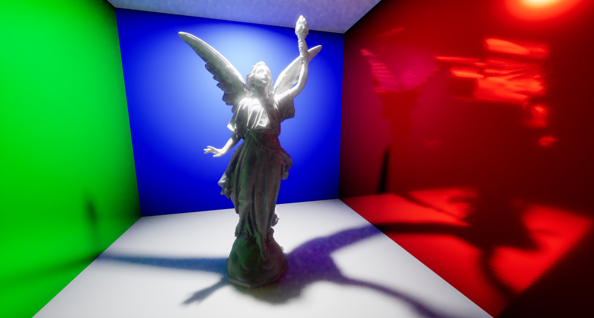
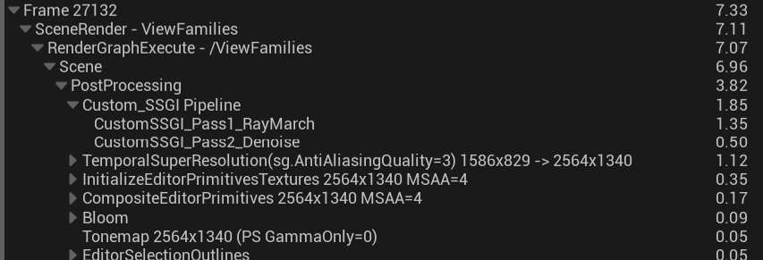
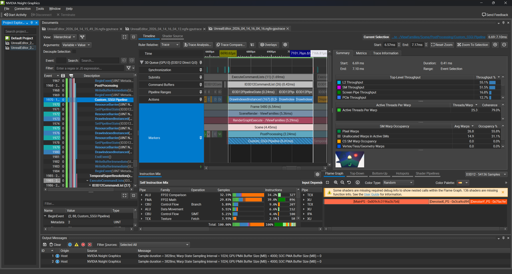
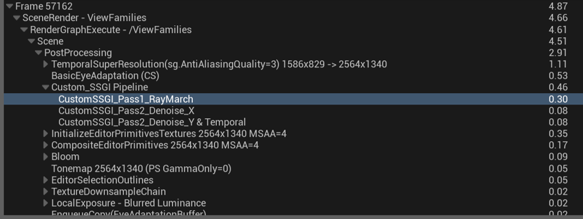
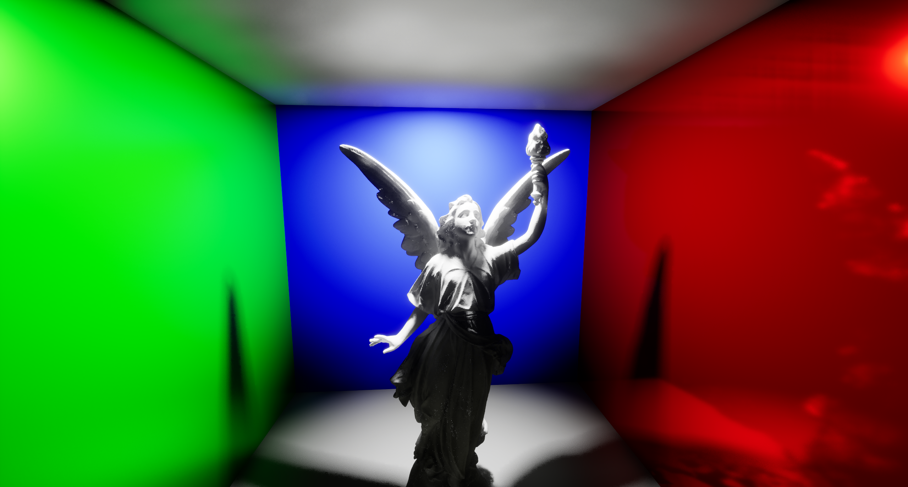
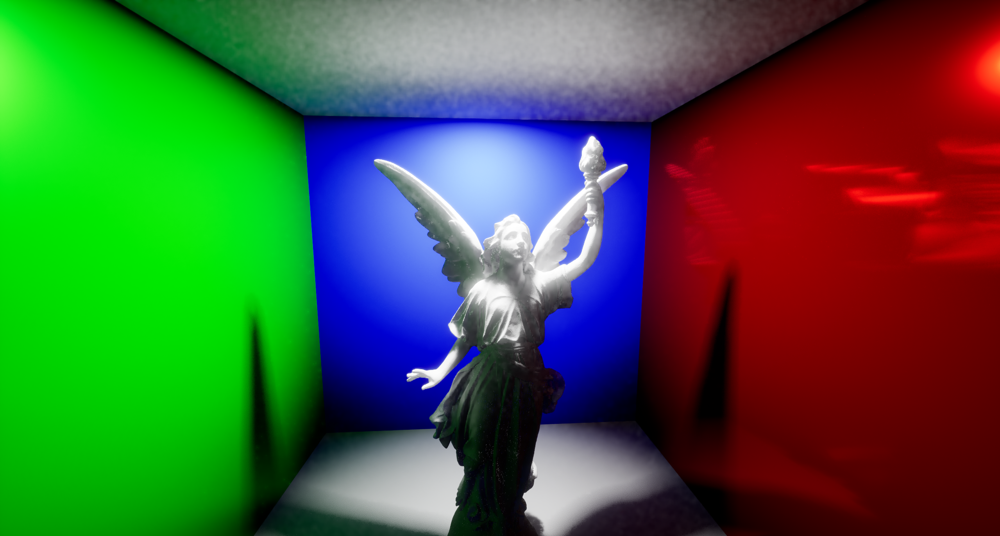
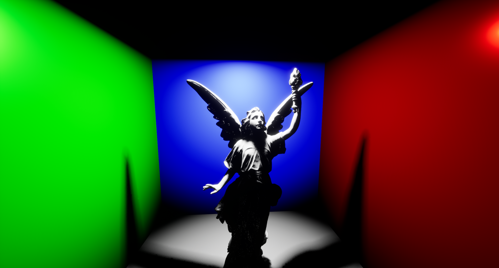
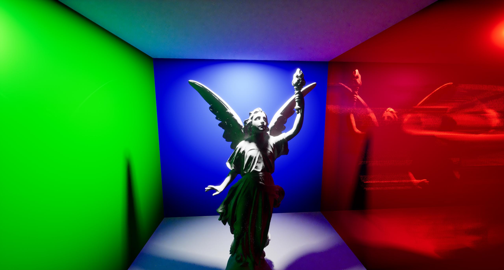

# UE5 Custom SSGI with RDG Pipeline and Profiling-Based Optimization

A custom Screen Space Global Illumination (SSGI) prototype implemented as a **UE5 plugin inside a runnable host project** by directly extending the post-process rendering pipeline with **SceneViewExtension + RDG**.

This project focuses not only on implementing real-time GI, but also on **profiling bottlenecks and optimizing the pipeline for practical performance**.

> **Key result:** Implemented a custom SSGI system on UE5. Reduced the internal custom SSGI pipeline cost from **1.85 ms to 0.46 ms** (~75.13% optimization), and compared it against No GI, Lumen, and UE5 Screen-Space GI in the same test scene. In the final comparison, Custom SSGI measured **5.03 ms Graphics Queue Avg**, adding only **+0.47 ms** over No GI and showing **21.8% lower rendering time than Lumen**.
---

## Verification Status

This repository is not just a code snapshot of the plugin source.

It includes the **host UE5 project (`Test4.uproject`)**, plugin source, content, and demo assets, and it was **successfully verified by cloning into a separate directory and rebuilding the project from the cloned repository**.

That means the repository can be reviewed in two ways:

- **Code review:** inspect the plugin source, shader code, and project structure
- **Executable review:** clone the repository, open the UE5 project, rebuild, and run the demo map

---

## Overview
<p align="center">
  
</p>

This project started from a simple question:

**Can I inject a custom real-time GI system into UE5's post-process pipeline, and then optimize it enough to become a practical high-performance alternative for selected use cases?**

To answer that, I built a custom SSGI pipeline from scratch inside UE5 by:

- registering a custom `FSceneViewExtension`
- hooking into the post-process stage with **RDG**
- reconstructing scene information from **G-Buffer**
- implementing screen-space ray marching
- adding denoising and temporal accumulation
- preserving history across frames
- profiling each pass with **NVIDIA Nsight**
- redesigning the slowest parts of the pipeline

This repository is the technical implementation behind the portfolio project submitted for a graphics programming role.

---

## What I Implemented

### 1. UE5 rendering pipeline bridge
- Built a custom plugin module that accesses UE5 renderer internals
- Added shader source directory mapping for plugin shaders
- Registered a custom `FSceneViewExtension` after engine initialization
- Subscribed to the post-process pipeline before DOF

### 2. Multi-pass RDG architecture
- Implemented an RDG-based multi-pass pipeline instead of a single fullscreen shader
- Structured the pipeline as:
  1. **Ray Marching Pass**
  2. **Denoise X Pass**
  3. **Denoise Y + Temporal Accumulation Pass**
- Managed intermediate textures and final outputs through RDG
- Split **diffuse** and **specular** signals into separate render targets for better temporal behavior

### 3. G-Buffer based screen-space GI
- Read scene textures through UE5 scene texture parameters
- Reconstructed depth / normal / scene color information
- Implemented screen-space ray marching and hit testing
- Extended the prototype from an SSR-style starting point toward indirect diffuse/specular GI

### 4. Stateful temporal pipeline
- Preserved previous-frame results using `IPooledRenderTarget`
- Built ping-pong style history handling for diffuse and specular buffers
- Combined current-frame and history data to stabilize 1-SPP rendering

### 5. Profiling-based optimization
- Measured GPU cost with **NVIDIA Nsight**
- Identified major bottlenecks in:
  - ray marching pass
  - geometry-aware blur pass
- Replaced expensive parts of the pipeline with more efficient designs:
  - **3D ray marching → 2.5D DDA**
  - **2D blur → separable Gaussian blur**

---

## Technical Highlights

### SceneViewExtension + RDG integration
Instead of modifying UE5 engine source directly, I used `FSceneViewExtensionBase` as a safe integration point and injected custom rendering passes into the engine's post-process flow.

This allowed me to build an engine-level rendering feature as an external plugin while keeping the implementation inside a normal UE5 project.

### History buffer management
A temporary RDG texture is reset every frame, so temporal accumulation requires persistent external resources.

To solve that, I used `IPooledRenderTarget` to preserve diffuse/specular history buffers across frames and extracted the current outputs back into history at the end of the pass chain.

### Diffuse / specular separation
Diffuse and specular components have very different temporal and spatial characteristics.

I separated them into different render targets and histories so that each signal could be filtered and accumulated more appropriately.

### Low-discrepancy temporal sampling
To improve convergence and temporal stability, I experimented with low-discrepancy sampling ideas such as **Halton sequence** instead of relying only on naïve per-frame random noise.

---

## Pipeline Structure

```text
SceneViewExtension registration
    ↓
SubscribeToPostProcessingPass(BeforeDOF)
    ↓
Pass 1: CustomSSGI_Pass1_RayMarch
    - read scene textures
    - compute noisy diffuse/specular GI
    ↓
Pass 2: CustomSSGI_Pass2_Denoise_X
    - horizontal denoising
    ↓
Pass 3: CustomSSGI_Pass2_Denoise_Y & Temporal
    - vertical denoising
    - temporal accumulation with history
    - final composition
    ↓
QueueTextureExtraction
    - save diffuse/specular history for next frame
```

---

## Profiling and Optimization

The most important part of this project was not just making GI work, but making it **measurably faster**.

### Bottlenecks found
Using **NVIDIA Nsight**, I found that the main performance bottlenecks were:
- the ray marching pass
- the blur / denoising pass

<p align="center">
  
</p>

### Optimization work
- Converted brute-force **3D ray marching** into a more efficient **2.5D DDA-based traversal**
- Replaced expensive 2D blur with **separable Gaussian blur**
- Reduced unnecessary per-step computation inside the inner traversal loop
- Restructured the pipeline to better fit UE5's RDG workflow

### Result
- **Before optimization:** 1.85 ms
- **After optimization:** 0.46 ms
- **Improvement:** ~75.13%

<p align="center">
  
  
<p align="center">
  
</p>

---

## Follow-up Improvements

After the initial implementation and optimization pass, the pipeline went through a review-driven hardening round focused on trace accuracy and temporal stability.

### Trace accuracy
- **Distance-based fade for ray hits.** GI contribution now fades with hit distance (squared falloff reaching zero exactly at the trace limit). The hit distance is computed with a **perspective-correct remap** of the screen-space march fraction using the segment's clip-space `w` endpoints — using the raw screen-space fraction would make the fade view-dependent. The fade is a screen-space confidence/variance control (an intentional bias), not a physical attenuation term, and is softened by roughness for specular since real mirror reflections do not attenuate with distance.
- **Near-plane clipping.** Rays pointing toward the camera could place the segment end point behind the camera (clip `w <= 0`), flipping the perspective divide and marching in a meaningless direction. The traced segment is now clipped against the near plane, and the traced world length is scaled accordingly so the hit-distance remap stays exact.

### Temporal stability
- **Per-view history.** History buffers are keyed by `View.GetViewKey()`, so multiple viewports (editor + PIE) no longer overwrite each other's accumulation. Entries from closed viewports are evicted automatically.
- **Depth-based history rejection.** Each pixel's view depth is stored in the otherwise-unused alpha channel of the diffuse history target. On reprojection it is compared against the depth the surface should have had in the previous frame; a mismatch means the history texel was written by a different (occluding) surface, and history is discarded. This removes disocclusion ghosting at object edges during camera translation.
- **Neighborhood variance clipping.** Reprojected history can be clamped to the mean ± γσ of the current frame's blurred GI (collected inside the existing blur loop at no extra bandwidth cost). A min/max AABB was evaluated first but produced blocky artifacts: with sparse 1spp GI, any tight neighborhood bound couples the smooth history to kernel-scale noise splotches. The validated default is therefore intentionally loose (γ = 99), which effectively only resets history where the neighborhood is unanimously empty; γ can be lowered for scenes with dynamic lighting.
- **Longer accumulation.** With rejection handling stale history, the default diffuse temporal blend weight was lowered from 0.025 to **0.0025** (~400-frame convergence), visibly reducing residual noise in the static demo scene.
- **Reprojection validation** against the real render rect (`View.BufferBilinearUVMinMax`) instead of the 0–1 UV range, plus rejection of points behind the previous camera.

### Runtime tuning (console variables)

| CVar | Default | Description |
| --- | ---: | --- |
| `r.CustomSSGI.Enable` | 1 | Toggle the whole pipeline. Disabling also releases history buffers. |
| `r.CustomSSGI.MaxRayLength` | 2000 | Maximum trace distance in world units (cm). |
| `r.CustomSSGI.MaxSteps` | 40 | Ray marching steps per pixel. |
| `r.CustomSSGI.Temporal.DiffuseAlpha` | 0.0025 | Diffuse temporal blend weight; lower accumulates longer. |
| `r.CustomSSGI.Temporal.ClampGamma` | 99 | Variance clipping strength; lower is more responsive, `<= 0` disables. |

### Code quality
- Removed several hundred lines of dead/commented-out experiments across the shader and plugin C++.
- Fixed a GPU stat scope that measured nothing under deferred RDG execution (`SCOPED_GPU_STAT` → `RDG_GPU_STAT_SCOPE`).
- Fixed module header encoding (CP949 → UTF-8) and delegate lifetime handling on module shutdown.

---

## Additional GI Mode Comparison

After optimizing the custom SSGI pipeline, I also compared the result against several UE5 GI configurations in the same test scene.

The purpose of this comparison was not to claim that the custom SSGI is a full replacement for Lumen, but to evaluate how much indirect lighting and color bleeding it can provide at a lower rendering cost in a controlled screen-space scenario.

### Compared modes

* **No GI**: Direct light only baseline
* **Lumen**: UE5's high-quality GI baseline
* **UE5 Screen-Space GI (Beta)**: Built-in screen-space GI comparison
* **Custom SSGI**: My custom RDG-based screen-space GI implementation

### Visual comparison

<p align="center">
  
  
</p>

<p align="center">
  
  
</p>

### Performance comparison

Rendering time was measured using **UE5 stat GPU Graphics Queue Total Avg** on an **RTX 4070 Ti** environment.

| Mode                | Rendering Time (Avg.) |   vs Lumen | Extra vs No GI | Estimated FPS |
| ------------------- | --------------------: | ---------: | -------------: | ------------: |
| No GI               |               4.56 ms |    -29.31% |              - |        219.30 |
| Lumen               |               6.43 ms |          - |       +1.87 ms |        155.52 |
| UE5 Screen-Space GI |               5.34 ms |     -17.0% |       +0.78 ms |        187.27 |
| Custom SSGI         |           **5.03 ms** | **-21.8%** |   **+0.47 ms** |    **198.81** |

> Lower rendering time is faster.
> `Extra vs No GI` represents the additional rendering cost over the direct-light-only baseline.

### Analysis

The custom SSGI result is not intended to replace Lumen as a general-purpose GI solution.
However, in this test scene, it produced visible indirect lighting and color bleeding with only **+0.47 ms** over the direct-light-only baseline, while showing **21.8% lower rendering time than Lumen**.

This suggests that a custom screen-space GI pipeline can be useful as a lightweight GI option for selected scenes where screen-space limitations are acceptable.

---

## Tech Stack

- **Language:** C++
- **Engine:** Unreal Engine 5
- **Graphics Framework:** RDG (Render Dependency Graph)
- **Engine Hook:** `FSceneViewExtension`
- **Shader Language:** HLSL / `.usf`
- **Profiling / Debugging:** NVIDIA Nsight
- **Concepts:** G-Buffer reconstruction, screen-space ray marching, temporal accumulation, denoising, low-discrepancy sampling

---

## Repository Structure

```text
Test4.uproject
Config/
Content/
  NewMap1.umap
  ...
Docs/
  final_result.png
  nsight_profile.png
Plugins/
  CustomSSGI/
    CustomSSGI.uplugin
    Shaders/
      CustomSSGI.usf
    Source/
      CustomSSGI/
        CustomSSGI.Build.cs
        Public/
          CustomSSGI.h
          CustomSSGIViewExtension.h
        Private/
          CustomSSGI.cpp
          CustomSSGIViewExtension.cpp
Source/
  Test4/
  Test4.Target.cs
  Test4Editor.Target.cs
README.md
```

---

## Key Files

### `Plugins/CustomSSGI/Source/CustomSSGI/CustomSSGI.Build.cs`
Configures module dependencies and renderer access.
- `Renderer`
- `RenderCore`
- `RHI`
- renderer private include path

### `Plugins/CustomSSGI/Source/CustomSSGI/Private/CustomSSGI.cpp`
Plugin startup/shutdown logic.
- shader directory mapping
- post-engine-init registration
- `FSceneViewExtension` creation

### `Plugins/CustomSSGI/Source/CustomSSGI/Public/CustomSSGIViewExtension.h`
Defines the custom view extension.
- lifecycle hooks
- post-process subscription
- diffuse/specular history buffers

### `Plugins/CustomSSGI/Source/CustomSSGI/Private/CustomSSGIViewExtension.cpp`
Core rendering implementation.
- custom post-process callback
- RDG pass creation
- render target allocation
- fullscreen pass execution
- history extraction

### `Plugins/CustomSSGI/Shaders/CustomSSGI.usf`
Shader implementation for:
- ray marching
- denoising
- temporal accumulation
- composition

---

## Build / Run

### Tested Environment
- **Engine Version:** UE 5.7.4
- **OS:** Windows
- **IDE:** Visual Studio 2022

### How to Run
1. Clone this repository
2. Make sure Git LFS is installed so `.uasset` and `.umap` files are pulled correctly
3. Open `Test4.uproject`
4. If prompted, rebuild the project modules
5. Launch the Unreal Editor
6. Open the demo map (`NewMap1`)
7. Run in PIE / standalone and inspect the custom SSGI result

### Clone / Rebuild Verification
This workflow was tested by:
- cloning the repository into a separate directory
- rebuilding the cloned UE5 project
- launching the project successfully
- confirming that the custom SSGI plugin works as intended in the cloned build

---

## Reproducibility Note

This repository is organized as an **executable UE5 demo project**, not just as a plugin-only code dump.

Because the repository includes the host project, plugin source, content, and demo map, reviewers can verify the work at multiple levels:
- source-level architecture and implementation
- shader integration and renderer access
- project buildability
- runtime behavior inside the demo scene

Minor setup adjustments may still be required if the reviewer uses a different UE5 minor version.

---

## Limitations

This is a **graphics programming prototype**, not a production replacement for UE5 Lumen.

Current limitations include:
- screen-space techniques cannot recover information outside the visible frame
- moving objects are not yet velocity-reprojected (the demo scene is static; camera motion, including translation, is fully reprojected)
- rays that miss return zero radiance — there is no sky/probe fallback yet, so the technique loses energy compared to a reference
- hit radiance is taken from the camera-facing scene color, which assumes hit surfaces are roughly Lambertian
- quality/performance trade-offs still depend on scene conditions
- production use would require more robustness, validation, and scalability work

---

## What I Learned

This project taught me that graphics programming is not just about producing an interesting image.

It is about:
- designing a rendering feature inside a complex engine architecture
- understanding how data moves across passes and frames
- using profiling tools to locate real bottlenecks
- controlling the trade-off between quality and performance with measurable data

The most valuable part of this work was moving from **“effect implementation”** to **“engine-level rendering architecture + profiling-driven optimization.”**

---

## Contact

- GitHub: https://github.com/whlee503
- Email: whlee503@ajou.ac.kr
